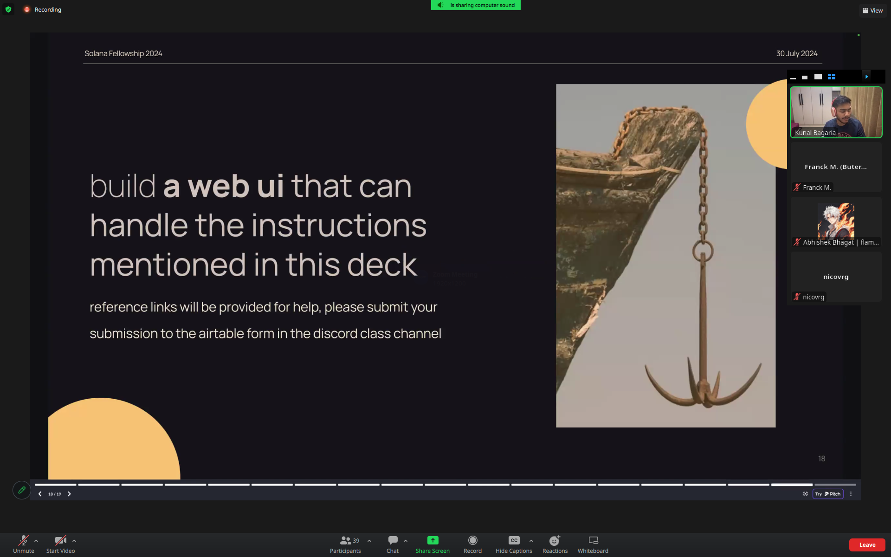
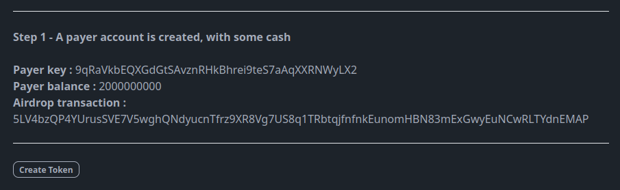
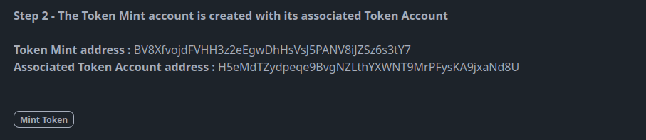
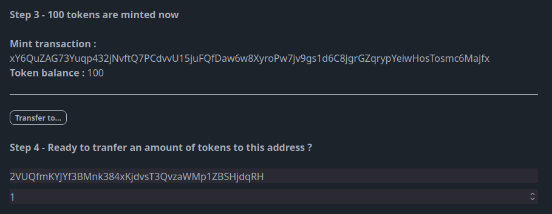
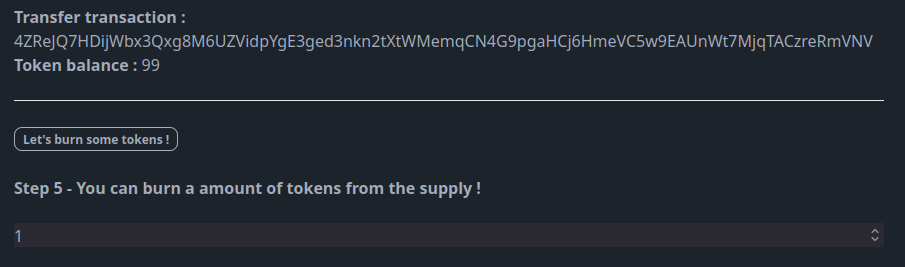
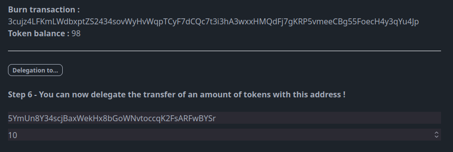
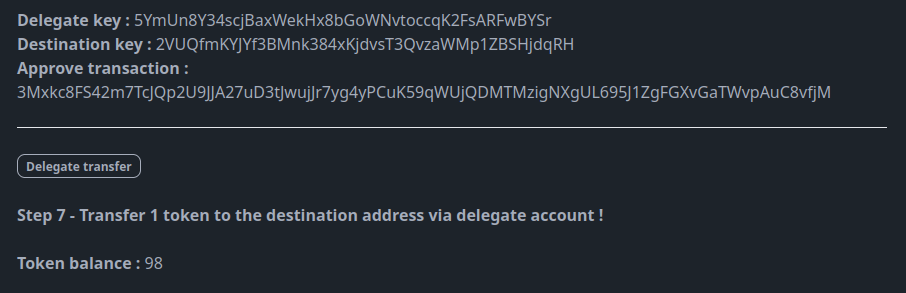
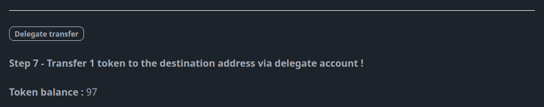

# solana-web3-next

## Vercel Link 

**[solana-web3-next](https://ssf-s2-exo.vercel.app/)**

## Overview



**Exercise:** Build a **web UI** that can handle creation of a token, it's mint, transfer of that token, burning the token supply, and delegation the ata of this token to another public key.

Topics in this exercice:
- Keypair generation
- Airdrop
- Mint account creation
- ATA creation
- Token mint operation
- Token balance
- Token transfer
- Token burning
- Authority delegation
- Token transfer via delagation

This project is generated with the [create-solana-dapp](https://github.com/solana-developers/create-solana-dapp) generator.

And deployed on Vercel : [solana-web3-next](https://ssf-s2-exo.vercel.app/)

## Tree repository

```
.
├── web
│   ├── app
│   │   ├── account
│   │   │   ├── [address]
│   │   │   │   └── page.tsx
│   │   │   └── page.tsx
│   │   ├── api
│   │   │   └── hello
│   │   │       └── route.ts
│   │   ├── clusters
│   │   │   └── page.tsx
│   │   ├── global.css
│   │   ├── layout.tsx
│   │   ├── page.module.css
│   │   ├── page.tsx
│   │   └── react-query-provider.tsx
│   ├── components
│   │   ├── account
│   │   │   ├── account-data-access.tsx
│   │   │   ├── account-detail-feature.tsx
│   │   │   ├── account-list-feature.tsx
│   │   │   └── account-ui.tsx
│   │   ├── cluster
│   │   │   ├── cluster-data-access.tsx
│   │   │   ├── cluster-feature.tsx
│   │   │   └── cluster-ui.tsx
│   │   ├── dashboard
│   │   │   └── dashboard-feature.tsx
│   │   ├── solana
│   │   │   └── solana-provider.tsx
│   │   └── ui
│   │       └── ui-layout.tsx
│   ├── public
│   │   ├── favicon.ico
│   │   └── logo.png
│   ├── index.d.ts
│   ├── next.config.js
│   ├── next-env.d.ts
│   ├── postcss.config.js
│   ├── project.json
│   ├── tailwind.config.js
│   └── tsconfig.json
├── 2024-08-04-08-26-31.png
├── LICENSE
├── nx.json
├── package.json
├── package-lock.json
├── README.md
├── tsconfig.base.json
└── vercel.json
```
## Usage with screenshots

### Accounts created (+airdrop)


### Token account created


### Tokens minted


### Token transfer


### Token burning


### Delegation


### Transfer via delegation


## Code snippets

### bla
```typescript

```

### Keypair generation + airdrop
```typescript
const newPayer = await Keypair.generate();
console.log("mainInit (payer)"+newPayer.publicKey.toBase58());

const airdropSignature = await connection.requestAirdrop(newPayer.publicKey, 2 * LAMPORTS_PER_SOL);
connection.confirmTransaction(airdropSignature).then(()=> {
    setPayer(newPayer);
    setAidropTx(airdropSignature);
})
```
### Mint account creation
```typescript
let newMintPubkey = await createMint(
  connection      ,   // connection
  payer           ,   // fee payer
  payer.publicKey,    // mint authority
  null           ,    // freeze authority (you can use `null` to disable it. when you disable it, you can't turn it on again)
  decimals       ,    // decimals
);

console.log(newMintPubkey.toBase58());

```

### ATA creation
```typescript
const newTokenAccount = await getOrCreateAssociatedTokenAccount(
  connection,
  payer,
  newMintPubkey,
  payer.publicKey
);

console.log("Token Account");
console.log("ATA", newTokenAccount.address.toBase58());

```

### Token mint operation
```typescript
let mintTx = await mintTo(
  connection          ,            // connection
  payer               ,            // payer
  mintPubkey          ,            // mint
  tokenAccount.address,            // destination
  payer.publicKey     ,            // authority
  mintAmount                       // amount
);
console.log('Mint Transaction:', mintTx);


await setAuthority(
  connection,
  payer          ,      // Payer of the transaction fees
  mintPubkey     ,      // Account 
  payer.publicKey,      // Current authority 
  0              ,      // Authority type: "0" represents Mint Tokens 
  null                  // Setting the new Authority to null
);
console.log('Authority is set !');
```

### Token balance
```typescript
const tokenAccountInfo = await getAccount(
  connection,
  tokenAccount.address
);
console.log('Token Account Info:', tokenAccountInfo.amount);
const newBalanceToken = tokenAccountInfo.amount / BigInt(Math.pow(10, decimals));
console.log(newBalanceToken);

```

### Token transfer
```typescript
// Get the token account of the toWallet Solana address. If it does not exist, create it.
const toATA = await getOrCreateAssociatedTokenAccount(
  connection,
  payer,
  mintPubkey,
  pk
);
console.log("Token Account");
console.log("ATA (to)", toATA.address.toBase58());

let tx = await transfer(
  connection          ,                // connection
  payer               ,                // payer
  tokenAccount.address,                // source account
  toATA.address       ,                // destination account
  payer.publicKey     ,                // destination **
  amount*Math.pow     (10,decimals),   // amount
);

```

### Token burning
```typescript
const newBurnSignature = await burn(
  connection,
  payer                ,   // Payer of the transaction fees
  tokenAccount.address,    // Address of the account holding the tokens to burn
  mintPubkey           ,   // Mint of the token
  payer.publicKey      ,   // Owner of the account
  burnAmount*Math.pow(10,decimals)          ,    // Amount of tokens to burn
);
```

### Authority delegation
```typescript
const pk = new PublicKey(delegation);
console.log(pk.toBase58()); // Affiche l'objet PublicKey,puis en base58

const approveSignature = await approve(
  connection,
  payer,                // Payer of the transaction fees
  tokenAccount.address, // Account from which tokens can be transferred
  pk,                   // Delegate authority
  payer.publicKey,      // Owner of the token account
  delegateAmount*Math.pow(10,decimals)            // Amount of tokens the delegate is allowed to transfer
);
console.log("Delegation");
console.log(approveSignature);
```


### Token transfer via delagation
```typescript
const pkDelegation = new PublicKey(delegation);
console.log(pkDelegation.toBase58());
const pkDestination = new PublicKey(destination);
console.log(pkDestination.toBase58());

// Get the token account of the toWallet Solana address. If it does not exist, create it.
const toATA = await getOrCreateAssociatedTokenAccount(
  connection,
  payer,
  mintPubkey,
  pkDestination
);
console.log("Token Account");
console.log("ATA (to)", toATA.address.toBase58());

const delegateTransferAmount = 1;

const delegateTransferSignature = await transfer(
  connection,
  delegationWallet,      // Payer of the transaction fees X
  tokenAccount.address,  // Source account X
  toATA.address,         // Destination account X
  pkDelegation,          // Delegated authority
  delegateTransferAmount*Math.pow(10,decimals)     // Number of tokens to transfer
);
console.log("Delegate Transfer Signature:", delegateTransferSignature);

```
